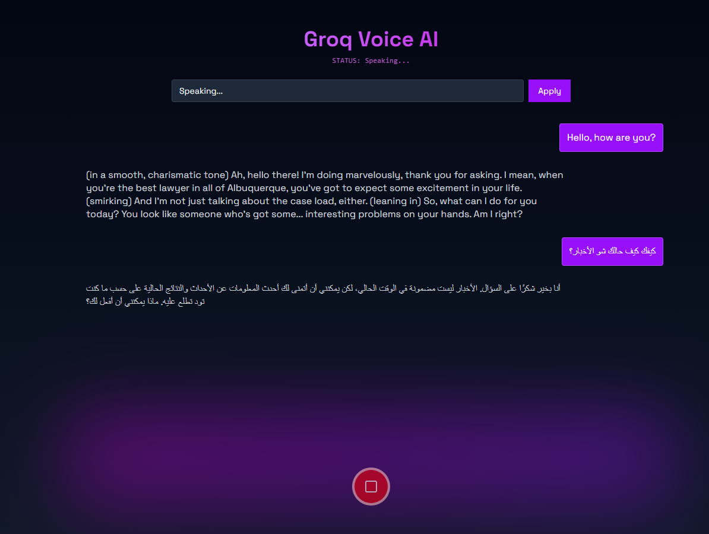

# **Groq Voice AI Assistant (Next.js 16)**

A fully-functional voice-controlled AI assistant built with **Next.js 16**, **Groq LLaMA 3.1**, **Whisper Large V3**, and **Groq TTS**.
The app allows users to:

* Record voice
* Transcribe speech to text
* Stream AI responses token-by-token
* Convert AI text back to audio
* Play the voice output instantly

Everything runs on **Edge runtime** for maximum speed.

## **Features**

### **Voice Input**

Record audio directly in the browser using `MediaRecorder`.

### **Whisper Transcription**

Audio is sent to `/api/transcribe` where Groq Whisper Large V3 turns speech → text.

### **AI Chat Response (Streaming)**

Text is sent to `/api/chat`, which streams responses from LLaMA 3.1 in real-time.

### **Text-to-Speech Output**

Final AI text is sent to `/api/speak` and returned as playable audio.

## **API Limitations**

Groq has:

* Rate limits
* Total audio length limits
* Model request caps

Avoid rapid repeated recordings or TTS spam.

---
## Overview
### Desktop  

## **Links**
**Live Site:** [GROQ voice AI](https://groq-voice-ai-assistant.vercel.app/)

## **Technologies Used**

* **Next.js 16**
* **TypeScript**
* **Groq Whisper Large V3**
* **Groq LLaMA 3.1**
* **Groq TTS**
* **Tailwind CSS**
* **React Hooks**
* **Edge Runtime**

## Author
- LinkedIn – [Jaafar Youssef](https://www.linkedin.com/in/jaafar-youssef-923100249/)

## License

For personal use and learning. 
